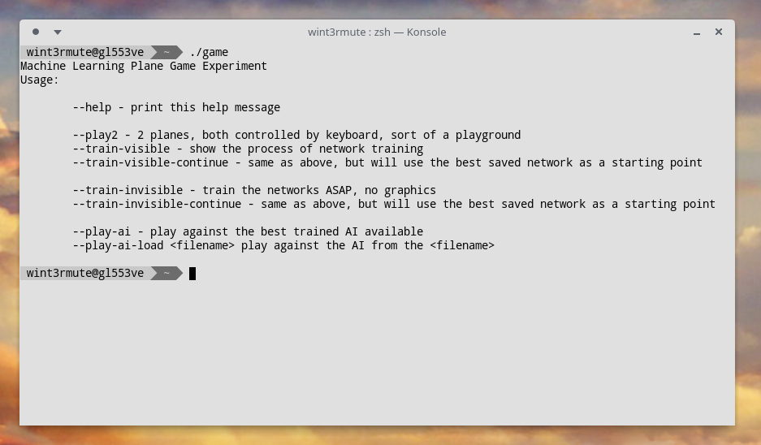

	<h2>
		Programowanie obiektowe  
		INEW0003P  
		Projekt
	</h2>

| Wydział elektroniki      	|    Kierunek: informatyka 	|
|	:-----------------------------------------------------	|----------------------------------:	|
| Grupa zajęciowa: Pt 17:05       &nbsp; 	| Semestr: 2017/2018 Lato  	|
| Nazwisko i Imię: Bączek Mateusz  	&nbsp;| Nr indeksu: 241330       	|
| Nazwisko i Imię: Szymon Filipiak &nbsp;&nbsp;&nbsp;&nbsp;&nbsp;&nbsp;&nbsp;&nbsp;&nbsp;&nbsp;&nbsp;&nbsp;&nbsp;&nbsp;&nbsp;&nbsp;&nbsp;&nbsp;&nbsp;&nbsp;&nbsp;&nbsp;&nbsp;&nbsp;&nbsp;&nbsp;&nbsp;&nbsp;&nbsp;&nbsp;&nbsp;&nbsp;&nbsp;&nbsp;&nbsp;&nbsp;&nbsp;&nbsp;&nbsp;&nbsp;&nbsp;&nbsp;&nbsp;&nbsp;&nbsp;&nbsp;&nbsp;&nbsp;| Nr indeksu: 241309 	|
| Nr grupy projektowej: 	| 1 |
| Prowadzący: 	| mgr inż. Adam Włodarczyk	|

## Temat: Trenowanie sieci neuronowych w grze zręcznościowej

<h4>
Ocena: 
Punkty: 
Data:  
</h4>

## Założenia i opis funkcjonalny programu
#### Założenia
Program demonstruje możliwości uczenia sztucznych sieci neuronowych w symulowanym środowisku gry zręcznościowej - bitwy samolotów. Aplikacja umożliwia wytrenowanie samolotów do walki między sobą, walkę sztucznej inteligencji z człowiekiem i zapis stanu wytrenowanej sieci do pliku w celu późniejszego kontynuowania treningu lub wczytania w celu gry z człowiekiem.

#### Dodatkowe funkcje
Program posiada funkcję trenowania sieci w tempie przyspieszonym, bez uruchomionej graficznej warstwy aplikacji, można w ten sposób zainstalować go na zdalnym serwerze i przeprowadzać na nim przyspieszoną symulację.

#### Mechanika gry
Gracz kontroluje jeden z kilku samolotów na planszy. Samoloty poruszają się do przodu przez cały czas, ale ich prędkość maleje wraz z wznoszeniem się, a rośnie podczas spadania. Gracz odpowiada za skręcanie samolotem, zwiększanie prędkości poprzez użycie specjalnej umiejętności (boost) oraz strzelanie. Samoloty ulegają zniszczeniu jeżeli wejdą w kolizję z innym obiektem (pociskiem lub innym samolotem). Gdy samolot doleci do krawędzi ekranu, pojawia się z jego drugiej strony. Przyśpieszenie oraz karabin mają swoje czasy przeładowania.

#### Sztuczna inteligencja
Samolot może być kontrolowany nie tylko przez człowieka, ale także przez bota - sztuczną sieć neuronową. Każdy bot jest wyposażony komórki wzrokowe odpowiedzialne za pozyskiwanie kierunku i odległości innych obiektów gry od samolotu, którym bot kieruje. Te informacje są przekazywane jako argumenty wejścia dla sieci neuronowej. Zależnie od danych wyjściowych sieci neuronowej, samolot wykonuje odpowiednie akcje
(np  skręty, strzelanie).

## Diagramy
#### Use case

#### Klasy

 
 ## Opis użytkowy programu

Program posiada standardowy unixowy interfejs konsolowy, po uruchomieniu bez wpisaniu argumentów użytkownikowi zostaje zaprezentowany ekran możliwych opcji wywołania programu.

#### Opis funkcji:
- `--help` - wyświetla taki sam ekran pomocy jak w przypadku wywołania programu bez argumentów
- `--play2` - Uruchamia grę z dwoma samolotami sterowanymi przez ludzkich graczy, pierwszy steruje za pomocą strzałek, drugi za pomocą klawiszy WSAD
-  `--train-visible` - uruchamia proces trenowania z aktywną warstwą graficzną programu, użytkownik może obserwować postęp trenowania botów na ekranie
- `--train-visible-continue` - kontynuuje proces trenowania ostatniej zapisanej sieci (sieci zapisywane są automatycznie co każdą iterację trenowania)
- `--train-invisible` - rozpoczyna proces trenowania bez uruchomionej warstwy graficznej programu, w najszybszym możliwym tempie (na nowoczesnym procesorze i7 pozwala to na przyspieszenie symulacji około 450-500 razy)
Podczas trenowania w trybie niewidzialnym wyświetlany jest log symulacji, a po przerwaniu działania programu (za pomocą ctrl-c) wyświetlany jest czas, przez jaki symulacja działała (tj., ile czasu upłynęło wewnątrz symulacji)

Przykładowe wyjście programu w przypadku przerwania symulacji w trybie przyspieszonym

- `--train-invisible-continue` - to samo co `--train-visible-continue`, tylko w trybie przyspieszonym
- `--play-ai` - pierwszy samolot jest ostatnią trenowaną sztuczną inteligencją, drugi jest sterowany przez gracza
- `--play-ai-load <filename>` - to samo co powyżej, dodatkowo wymagany jest parametr wskazujący na nazwę pliku z zapisaną siecią, która zostanie załadowana jako pierwszy gracz

## Wnioski
Dzięki zrealizowaniu projektu  poszerzyliśmy wiedzę związaną z C++ i Pythonem. Udało nam się zaimplementować i wytrenować sieć neuronową (do pewnego stopnia skuteczności).

Programując ten sam projekt w dwóch róznych językach programowania, zauważyliśmy różnice między C++em a Pythonem, najważniejsze z nich to:
 - Znacznie łatwiejsze instalowanie bibliotek w Pythonie
 - Większa dostępność łatwych do uruchomienia bibliotek do symulacji fizycznej i do grafiki (także w Pythonie)
 - Zdecydowaną przewagę w wydajności programu napisanego w C++ (Chociaż Python pozwala na zwiększenie wydajności obliczeniowej za pomocą bibliotek natywnych, na przykład Numpy, z której też korzystaliśmy)
 - Mniej wyraźny styl zarządzania pamięcią w Pythonie, utrudnione ręczne zarządzanie wyzwalaniem RAMu, język więcej rzeczy robi za programistę
 - Wirtualne środowisko w Pythonie (virtualenv) ułatwia zarządzanie zainstalowanymi modułami, brak podobnie prostego w obsłudze narzędzia w C++

Implementacja czujników sieci neuronowej uświadomiła nam, że jest bardzo wiele sposobów, w jaki możliwe jest dobranie danych wejściowych dla sieci, co potencjalnie mogłoby pozytywnie wpłynąć na ich skuteczność w grze.

#### Dokumentacja kodu źródłowego umieszczona jest w załączniku do maila

#### Link do repozytorium projektu:
https://github.com/Wint3rmute/project-oob-sem2
